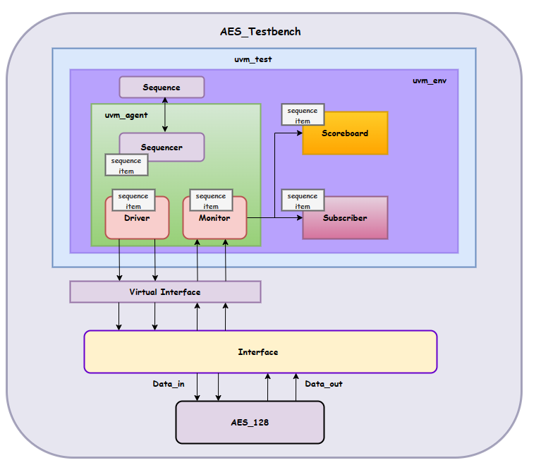

# AES - 128bits
### Design and Verification

 - **Design Methodology**
 - **Functional Verification**
 - **Vivado Synthesis**
---
1. *Design Methodology*
   
   *Plain Text: 128-bits ---
   Key       : 128-bits*
   1. Top Level
   
   

   > AES takes **```ten```** clock cycles to encrypt the **plain text** to **cypher text**

   2. Architectural Design

   
---
2. *Functional Verification*

   Verification of AES is done with the help of UVM environment

   ### AES Environment

   

   ```UVM Classes```
   ```sv
   class aes_sequencer extends uvm_sequencer
      // Controlling Sequence items
   endclass

   class aes_sequence_item extends uvm_sequence_item
      // Hold a single Transaction
   endclass

  
   class aes_sequence extends uvm_sequence
      // Hold the full Transactions (test cases)
   endclass

   class aes_driver extends uvm_driver
      // Drive input Stimulus from seq_level to pin level (from sequencer)
   endclass

   class aes_monitor extends uvm_monitor
      // Capture I/O for coverage/checking purpose
   endclass

   class aes_scoreboard extends uvm_scoreboard
      // Golden Model To Check with
   endclass

   class aes_subscriber extends uvm_subscriber
      // Coverage
   endclass

   class aes_agent extends uvm_agent
      // Wrapper for monitor/driver/sequencer
   endclass

   class aes_env extends uvm_env
      // Wrapper for agent/scoreboard/subsriber
   endclass

   class aes_test extends uvm_test
      // Top Wrapper
   endclass
   ```
   ```sv
   // To Run UVM_TEST
   run_test("aes_test");
---
1. *Vivado Synthesis*

   Synthesis is done via **BASYS-3** Xilinx Kit

      <div> <b> Vivado Result </b> </div>

      


